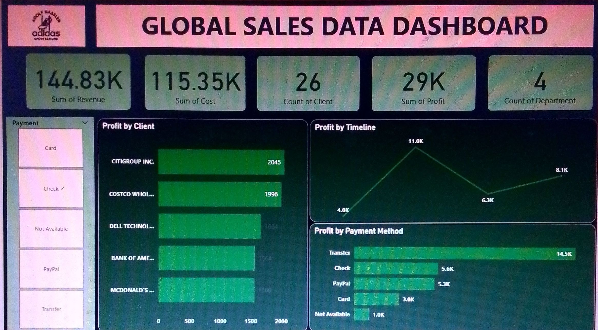
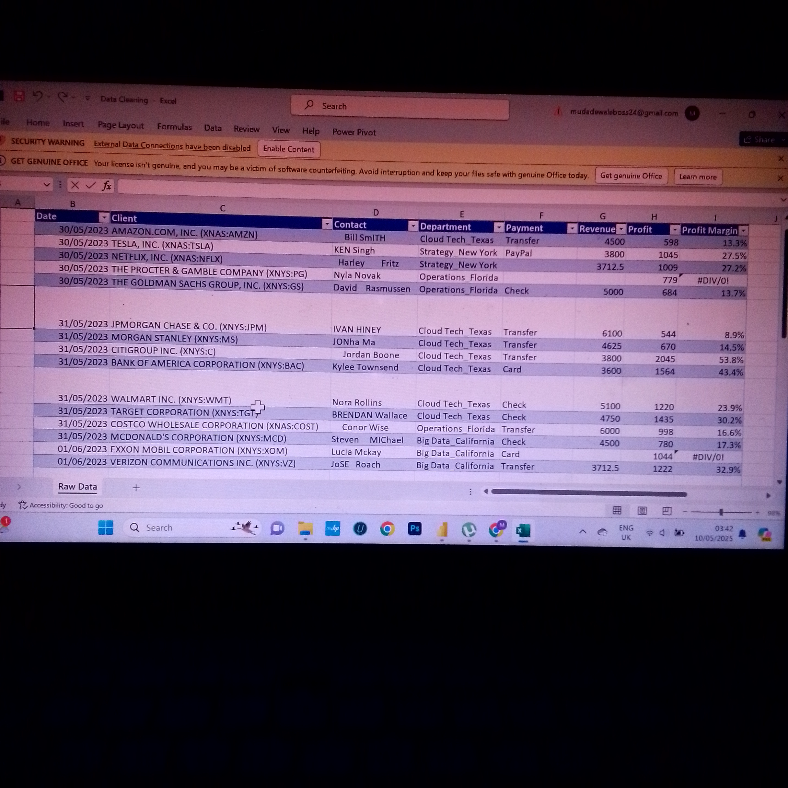
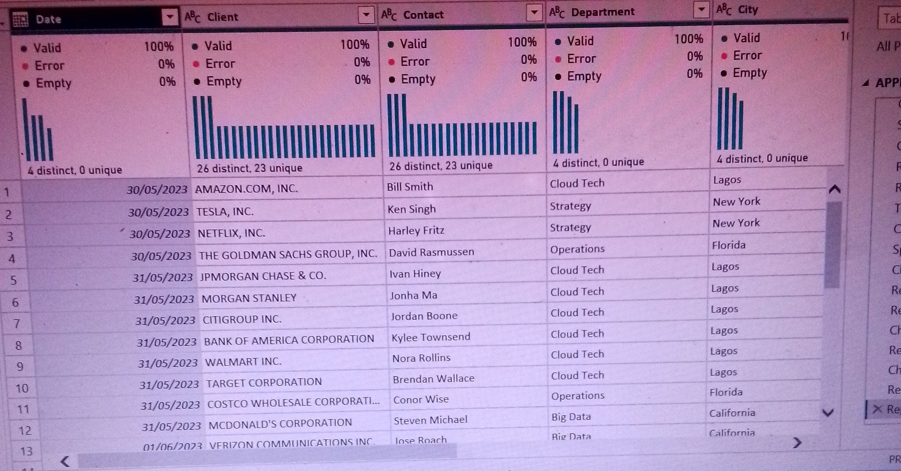

# Mubarak Enterprice Analysis

##INTRODUCTION:
This is a Power BI  project on sales analysis for **Mubarak Enterprice**.
The project aims to analyze and derive insight from activities so far.
**_Disclaimer_** : _All dataset and reports are imaginary_

##PROBLEM STATEMENT:
1. Find total revenue and profit made so far.
2. Number of clients.
3. Best performing payment method.

##SKILLS/CONCEPT DEMONSTRATED:
The following Power BI features were incorperated: 
- Data transform,
- Quick measures,
- Modelling,
- Filters,
- Themes

##Raw data(Excel view):

  | .jpg)

##Clean Data:

   |   

##DASHBOARD:

